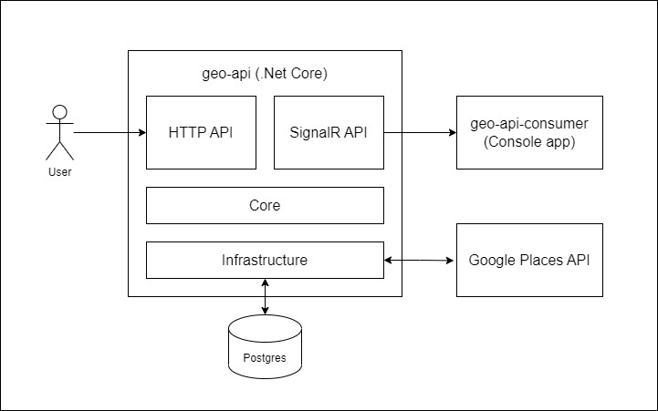

# geo-api

This is a prototype implementation of a high traffic API.
The application exposes an HTTP API that allows the user to query for information around a specific loication.
Under the hood, the app calls the Google Places API to get the information.
Every request is then logged, audited to the database and sent to all the subscribers connected to a SignalR hub.

System architecture:

### Scaling the application

The application is designed so that it can be easily distributed and scaled horizontally and vertically.
There are certain tradeoffs in scaling the HTTP and SignalR APIs, while they also differ in communication protocols.
Application instances can easily be put behind an API gateway or a load balancer that control the traffic and reduce the
pressure on each of the instances while also controlling authentication/authorization concerns and hiding the actual
servers that do the bulk of the work.

#### Scaling the HTTP API

The API can be easily be scaled vertically by assigning more compute power to the application.
Most of the time, this is a more expensive option so it's usually better to scale it horizontally by adding more
instances of the application. This could improve availability and maintenance costs, but usually also requires a gateway
or a load balancer and is (usually) more complex to manage.
Additionally, a layer of caching (Redis, custom) can be added so that incoming duplicate requests or requests with close
enough search parameters or responses can get cached, precomputed answers which can reduce the response time drastically
since there are no database or API trips to get the data.
The idea is making the HTTP API as stateless as possible so it can handle more traffic.

#### Scaling SignalR

Similar to the HTTP API, the first idea would be to allocate more compute. That works to a certain point, because there
is only so much traffic one instance can handle (read: the number of concurrent TCP connections that can be supported at
a time is limited).
This also introduces a single point of failure and possible traffic congestion during high traffic periods.
A better solution would (most of the time) be scaling out horizontally.
On the other hand, a signalR app needs to keep track of all its connections, which is a problem for a distributed
system.
There needs to be a mechanism for SignalR to keep track of all the available connections and sending messages between
instances to the connections.
The solution would be to use a Redis backplane to sync the application instances using SignalR about the available
connections and connected clients.
Another solution would be to use Azure SignalR Service that acts as a backplane and a proxy for the application
instances.
